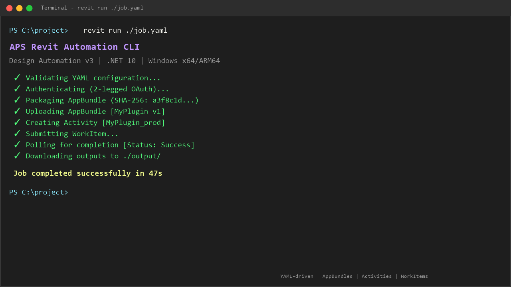

# APS Revit Automation CLI


[](https://dotnet.microsoft.com/en-us/download/dotnet/10.0)
[](https://aps.autodesk.com/en/docs/design-automation/v3/developers_guide/overview/)
[](https://opensource.org/licenses/MIT)

A .NET 10 CLI tool that wraps the Autodesk Platform Services Automation API for Revit. Define a single YAML configuration file describing your inputs and outputs, then run `revit run ./job.yaml` — the CLI handles AppBundle packaging and upload, Activity creation, WorkItem submission, polling, and output downloads automatically.

> **Companion Repository**: this CLI works with the Revit tools from [APS Automation API Revit MCP Tools Sample](https://github.com/autodesk-platform-services/aps-automation-api-revit-mcp-tools-sample).

> **Note**: This project was built with [Claude Code](https://claude.ai/code).



https://github.com/user-attachments/assets/28713419-1590-48a3-9a72-a14ef1725430

## Commands

### `revit run <yaml-file>`

Executes a complete Revit automation job:

1. Validates the YAML configuration
2. Authenticates (2-legged for setup, 3-legged for model access)
3. Packages and uploads the AppBundle (skips upload if unchanged)
4. Creates or updates the Activity
5. Submits and polls the WorkItem
6. Downloads outputs on success

```bash
revit run ./job.yaml
```

### `revit update <yaml-file>`

Force-uploads the AppBundle and creates or updates the Activity without submitting a WorkItem. Unlike `revit run`, which skips the upload when the AppBundle hash is unchanged, `revit update` always uploads — useful for pushing updated plugin code without running a full job. Run `revit run` afterward to execute the updated bundle.

```bash
revit update ./job.yaml
```

### `revit validate <yaml-file>`

Validates a YAML configuration file without running the job. Checks YAML syntax, required fields, and verifies that `app.path` exists on disk.

```bash
revit validate ./job.yaml
```

### `revit auth login`

Prompts for your APS `clientId` and `clientSecret`, then starts a browser-based 3-legged OAuth login flow. Credentials and tokens are cached in `~/.revit-cli/tokens.json` and refreshed automatically on subsequent runs, so they never need to appear in your `job.yaml`.

```bash
revit auth login
```

### `revit maxmodels [count]`

Gets or sets the maximum number of models allowed per multi-model automation run. The limit is stored in `~/.revit-cli/config.json` and defaults to 10.

```bash
revit maxmodels          # prints current limit
revit maxmodels 15       # sets limit to 15
```

### `revit auth status`

Shows the current authentication token status (valid, expired, or missing) and expiry time.

```bash
revit auth status
```

## YAML Configuration

> **Note**
> Credentials are not stored in `job.yaml`. Authenticate once with `revit auth login`; your `clientId`, `clientSecret`, and tokens are cached in `~/.revit-cli/tokens.json`.

See [`examples/job.yaml`](examples/job.yaml) for a complete example.

| Field | Required | Description |
|---|---|---|
| `revit.version` | Yes | Revit version: `latest`, `2022`, `2023`, `2024`, `2025`, `2026`, or `2027`. `latest` resolves to `2027`. |
| `app.name` | Yes | Unique name for the AppBundle and Activity. Must not contain hyphens (the Automation API rejects hyphenated AppBundle ids). |
| `app.description` | No | Optional description |
| `app.path` | Yes | Path to the local AppBundle folder |
| `environment` | No | Alias applied to the AppBundle and Activity. Must be `dev` or `prod`. Defaults to `prod`. |
| `inputs.model.type` | Yes | Must be `cloudWorksharedModel` |
| `inputs.model.folderUrl` | Yes | Browser URL to the folder containing the model |
| `inputs.model.modelName` | Conditional | Name of a single Revit model (without `.rvt`). Mutually exclusive with `modelNames`. Omit both to process all RVT models in the folder. |
| `inputs.model.modelNames` | Conditional | List of Revit model names to process. Mutually exclusive with `modelName`. |
| `inputs.model.save` | No | Whether to save/sync the Revit model after processing. Default: `true`. Set to `false` for read-only operations. |
| `inputs.model.openOption` | No | Workset open behavior. One of: `OpenAllWorksets` (default), `CloseAllWorksets`, `CloseWorksetsWithRevitLinks`. |
| `inputs.tool.name` | No | Tool identifier passed to the AppBundle (emitted as `toolName` in `revitmodel.json`). |
| `inputs.tool.inputs` | No | Path to a local JSON file delivered to the AppBundle as `toolinputs.json`. If absent, `toolinputs.json` receives `{}`. |
| `outputs.result.type` | No | Output type (e.g., `file`). Required only if `outputs.result.path` is set. Omit the entire `outputs` section to skip output bucket creation and download. |
| `outputs.result.path` | No | Local path where the output file will be downloaded. Required only if `outputs.result.type` is set. Supports `{modelName}` placeholder for multi-model runs. |

## Multi-Model Automation

The CLI supports three modes for specifying which models to process:

**Case 1 — Single model** (default): set `inputs.model.modelName` to a single model name. Behavior is unchanged from previous versions.

```yaml
inputs:
  model:
    folderUrl: "https://acc.autodesk.com/docs/files/projects/..."
    modelName: "MyBuilding"
```

**Case 2 — All models in folder**: omit both `modelName` and `modelNames`. The CLI discovers all RVT models in the folder and submits one workitem per model.

```yaml
inputs:
  model:
    folderUrl: "https://acc.autodesk.com/docs/files/projects/..."
    # no modelName or modelNames — processes all RVT models
```

**Case 3 — Explicit list**: set `inputs.model.modelNames` to a list of model names.

```yaml
inputs:
  model:
    folderUrl: "https://acc.autodesk.com/docs/files/projects/..."
    modelNames:
      - "BuildingA"
      - "BuildingB"
```

`modelName` and `modelNames` are mutually exclusive — setting both produces a validation error.

### Output paths

For multi-model runs, use the `{modelName}` placeholder in the output path to create per-model output files:

```yaml
outputs:
  result:
    type: "file"
    path: "./outputs/{modelName}/result.zip"
```

If `{modelName}` is not present in the output path during a multi-model run, the CLI automatically inserts a subdirectory per model (e.g., `./outputs/buildinga/result.zip`).

### Model limit

The maximum number of models per run defaults to 10. Use `revit maxmodels` to view or change the limit:

```bash
revit maxmodels          # print current limit
revit maxmodels 20       # increase to 20
```

See [`examples/job-all.yaml`](examples/job-all.yaml) and [`examples/job-multi.yaml`](examples/job-multi.yaml) for complete multi-model examples.

## AppBundle ZIP Structure

The `app.path` directory must ends with `.bundle`. The CLI zips this directory automatically and computes a SHA-256 hash to skip redundant uploads on repeated runs.

```
MyPlugin.bundle/
  Contents/
    MyPlugin.dll
    MyPlugin.addin
    PackageContents.xml
```

## Development

### Prerequisites

- [.NET 10 SDK](https://dotnet.microsoft.com/download/dotnet/10.0)
- An [Autodesk Platform Services](https://www.youtube.com/watch?v=HvSP9dpJO7E&t) application (traditional type)
- Provisioned access to [Autodesk Forma](https://www.youtube.com/watch?v=jZU9NbPfDjk&t)
- An AppBundle folder containing your [Revit plugin](https://aps.autodesk.com/en/docs/design-automation/v3/tutorials/revit/step1-convert-addin/) 

### Installation

#### Option A — dotnet tool (recommended)

Requires the [.NET 10 SDK](https://dotnet.microsoft.com/download/dotnet/10.0).

```bash
dotnet tool install -g revitcli
```

Update to the latest version:

```bash
dotnet tool update -g revitcli
```

Uninstall:

```bash
dotnet tool uninstall -g revitcli
```

#### Option B — self-contained binary (no SDK required)

Download the latest ZIP for your architecture from [GitHub Releases](https://github.com/autodesk-platform-services/aps-revit-automation-cli/releases):

- `revit-win-x64-v*.zip` — Windows x64
- `revit-win-arm64-v*.zip` — Windows ARM64

Extract the ZIP and add the folder to your `PATH`.

### Known Limitations

This tool only supports Windows (win-x64 and win-arm64). Linux and macOS are not supported.

## Troubleshooting

Please contact us via https://aps.autodesk.com/en/support/get-help.

## License

This sample is licensed under the terms of the [MIT License](http://opensource.org/licenses/MIT). Please see the [LICENSE](LICENSE) file for more details.
